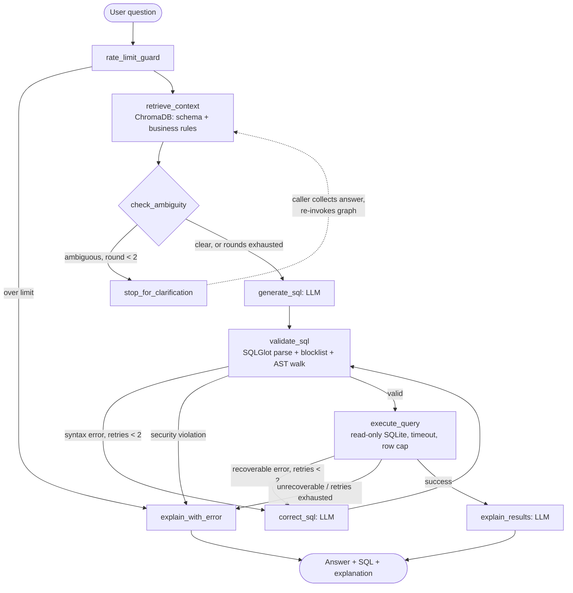

# SQLPilot

A text-to-SQL agent that **asks before it guesses**. Built with LangGraph, ChromaDB, SQLGlot, FastAPI, Streamlit, and Langfuse.

Ask a question in plain English, and SQLPilot retrieves the right schema and business context, checks whether your question is actually answerable without guessing, generates dialect-aware SQL, validates and self-corrects it before it ever touches the database, runs it in a locked-down read-only sandbox, and explains the result back to you in plain English — all while every step is traced for observability.

```
python -m app.cli "What are the top 5 customers by revenue?"
```

---

## Table of Contents

- [Why This Exists](#-why-this-exists-the-challenges-solved)
- [Architecture](#️-architecture)
- [How a Request Flows Through the System](#-how-a-request-flows-through-the-system)
- [Validation & Self-Correction](#️-validation--self-correction)
- [Security & Sandbox](#-security--sandbox)
- [Observability (Langfuse)](#-observability-langfuse)
- [API & Interface](#-api--interface)
- [Evaluation & Benchmarks](#-evaluation--benchmarks)
- [Project Status](#-project-status)
- [Getting Started](#-getting-started)
- [Project Structure](#-project-structure)

---

## ❓ Why This Exists (The Challenges Solved)

Building a text-to-SQL system that humans can actually trust is hard. Naive "prompt-in, query-out" scripts fail for predictable reasons. Here's how this project addresses each one, and where the code that does it lives.

### 1. The Hallucination Problem (Invented Columns)
* **Challenge:** LLMs guess column names from training data (e.g. generating `first_name`/`last_name` when the table only has `full_name`).
* **Solution — RAG grounding:** Before generation, the agent retrieves the *exact* schema chunks and business-rule documents relevant to the question from a local **ChromaDB** vector store, and the prompt requires the LLM to use only that retrieved context. (`app/rag/`, `app/agents/nodes/retrieve_context.py`)

### 2. The Domain Knowledge Gap (Ambiguity)
* **Challenge:** "What's our MRR?" or "show me revenue" mean nothing to an LLM without your business's specific definitions — and "revenue" alone is genuinely ambiguous (gross invoiced? net of tax? MRR? collected cash?).
* **Solution — knowledge base + clarification engine:** Business rules live as markdown files (`knowledge_base/*.md`) defining exact formulas (MRR, churn, CLV, resolution time, active users) and are retrieved alongside the schema. Separately, an ambiguity-detection node classifies the question across five ambiguity types (schema, value, temporal, metric, underspecified) *before* any SQL is generated. If it's genuinely ambiguous, the pipeline halts and asks a clarifying question — with multiple-choice options where possible — instead of silently picking an interpretation. (`app/agents/nodes/check_ambiguity.py`, `app/agents/prompts_clarification.py`)

### 3. Syntax & Dialect Errors
* **Challenge:** LLMs mix up dialect-specific syntax and occasionally produce SQL that just doesn't parse.
* **Solution — offline AST validation + self-correction:** Generated SQL is parsed with **SQLGlot** before it ever reaches the database. A parse failure is fed back to the LLM along with the exact error and the full history of prior failed attempts (so it doesn't repeat mistakes), up to 2 retries. (`app/validation/validator.py`, `app/agents/nodes/correct_sql.py`)

### 4. Runtime Errors (Wrong Column, Ambiguous Join, etc.)
* **Challenge:** SQL can be syntactically valid but still fail at the database (missing column, ambiguous join) — these only surface at execution time.
* **Solution — a second, independent correction loop:** Runtime errors are classified as recoverable or not (a missing-column error is worth retrying; a timeout or permission error isn't) and recoverable ones loop back through generation → validation → execution again, up to 2 retries. (`app/agents/nodes/execute_query.py`)

### 5. Database Security Risks
* **Challenge:** Prompt injection or a model mistake could produce a `DROP TABLE` or similar.
* **Solution — defense in depth, three layers:** (1) a keyword blocklist rejects `DROP`/`DELETE`/`INSERT`/`UPDATE`/`ALTER`/`CREATE`/etc. immediately; (2) an AST walk over the parsed SQLGlot tree catches mutation node types even if hidden in a subquery; (3) the database connection itself runs with `PRAGMA query_only = ON`, so even a query that slipped past both checks cannot write. Queries also get a statement timeout and a row cap so nothing can run forever or return unbounded data. (`app/validation/validator.py`, `app/db/connection.py`)

---

## 🏗️ Architecture

The core of the system is a **LangGraph state machine**. A single typed `AgentState` (the user's question, retrieved context, generated SQL, validation/execution errors, retry counters, clarification history) flows through a series of nodes with conditional routing — including two independent retry loops and an early-exit path for ambiguous questions.



Every node in this graph is wrapped as a Langfuse span, and every LLM call inside a node logs token usage — see [Observability](#-observability-langfuse).

### System Components

| Layer | Technology | Role |
|---|---|---|
| **Orchestrator** | LangGraph | Deterministic state machine with two retry loops and a clarification exit |
| **LLM** | Gemini Flash *or* Groq (provider-agnostic) | Swappable via `LLM_PROVIDER` in `.env` — same interface, no code changes |
| **Context engine (RAG)** | ChromaDB (in-process, persistent) + sentence-transformers (`all-MiniLM-L6-v2`, local, free) | Retrieves schema chunks + business-rule docs relevant to the question |
| **Validation** | SQLGlot | Offline parse + AST mutation scan, dialect-aware (SQLite/Postgres/MySQL) |
| **Database sandbox** | SQLite (demo) | Read-only via `PRAGMA query_only`, statement timeout, row cap |
| **Security** | Custom | Keyword + AST blocklist, in-memory sliding-window rate limiter |
| **API** | FastAPI + Pydantic | `POST /query`, `POST /clarify`, `GET /schema`, `GET /health` |
| **Frontend** | Streamlit | Chat UI; clarification shown as buttons |
| **Observability** | Langfuse Cloud | Per-node spans, per-LLM-call token usage, quality metrics, user feedback scores |

---

## 🔄 How a Request Flows Through the System

1. **Rate limit guard** — rejects the request before any LLM call if the session is over budget (default 20 requests/minute).
2. **Retrieve context** — embeds the question, pulls the top-K relevant schema chunks and business-rule documents from ChromaDB. Falls back to live DB introspection if the index is empty.
3. **Check ambiguity** — an LLM call classifies the question. If it's ambiguous (and we haven't already asked twice), the graph stops here and returns a clarification question, optionally with multiple-choice options.
4. **Generate SQL** — the LLM produces SQL plus its stated assumptions, grounded in the retrieved schema and business rules.
5. **Validate** — SQLGlot parses the SQL, runs the security blocklist, and walks the AST for mutation node types. Failures route to self-correction (up to 2 retries); security violations go straight to the error path — no retries wasted on policy violations.
6. **Execute** — runs against the read-only SQLite connection with a statement timeout and row cap. Runtime errors are classified recoverable/unrecoverable; recoverable ones loop back through correction (up to 2 retries).
7. **Explain** — the LLM turns the result set into a plain-English answer.

The clarification loop is **caller-managed**, not a LangGraph `interrupt()`: the graph simply terminates at `END` with `final_status: "clarification_needed"`, and the caller (CLI, or the FastAPI `/query` → `/clarify` pair) collects the user's answer and re-invokes the graph. This works identically for the CLI, the API, and the Streamlit UI, and needs no extra checkpointer infrastructure.

---

## 🛡️ Validation & Self-Correction

Two **independent** correction loops, both capped at 2 retries, both always routing back through validation (a correction is never trusted enough to skip straight to execution):

- **Loop 1 (syntax):** `validate_sql` fails → `correct_sql` (LLM sees the exact error + its own prior failed attempts) → `validate_sql` again.
- **Loop 2 (runtime):** `execute_query` fails with a recoverable error (missing column, ambiguous join, etc.) → `correct_sql` → `validate_sql` → `execute_query` again.

Each failed attempt is appended to `correction_history` in the state, so the LLM always has the full context of what it already tried and why it didn't work — it's explicitly asked to state `what_i_changed` on each retry, which forces it to actually reason about the fix rather than guess again.

---

## 🔒 Security & Sandbox

Defense in depth, enforced independently at three levels:

1. **Keyword blocklist** — `DROP`, `DELETE`, `INSERT`, `UPDATE`, `ALTER`, `CREATE`, `TRUNCATE`, `REPLACE`, `MERGE`, `GRANT`, `REVOKE`, `EXEC`/`EXECUTE`, `CALL`, matched as whole words to avoid false positives like `updated_at`.
2. **AST walk** — even a mutation hidden inside a subquery is caught by walking the parsed SQLGlot tree for `Drop`/`Delete`/`Insert`/`Update`/`Create`/`Alter` node types.
3. **DB-level read-only** — every connection sets `PRAGMA query_only = ON`; a query that somehow got past both checks above still cannot write.

Plus:
- **Statement timeout** (default 30s, via `threading.Timer` + `conn.interrupt()`) — a runaway query gets killed and reported as a friendly timeout, not a hang.
- **Row cap** (default 1000 rows) — no query can return unbounded data.
- **Rate limiting** — an in-memory sliding-window counter per session (default 20/minute), enforced as the very first node in the graph so rejected requests never reach an LLM call.

---

## 👁️ Observability (Langfuse)

Every request is traced end-to-end in [Langfuse Cloud](https://cloud.langfuse.com) (free tier), with graceful no-op behavior if you don't configure it.

- **One trace per user question**, spanning every clarification round — even across the two separate HTTP requests of the API's `/query` → `/clarify` flow.
- **Every graph node is a nested span** (`app/observability/tracing.py::traced_node`), so you can see exactly how long retrieval, generation, validation, and correction each took, and what each node read/wrote.
- **Every LLM call is a nested generation** with real prompt/completion/total token counts, so Langfuse can compute cost per request (when it recognizes the model in its pricing table) and aggregate it on the dashboard — no custom cost-aggregation code needed.
- **Quality metrics as trace metadata**: self-correction attempt count and clarification round count are logged on every trace, so you can query "how often does the system need to retry or ask for help" directly in Langfuse.
- **User feedback**: the CLI (and API, via the same primitives) can log a thumbs-up/down as a trace score.

---

## 🌐 API & Interface

**FastAPI backend** (`app/main.py`, `app/api/routes.py`):

| Endpoint | Purpose |
|---|---|
| `POST /query` | Submit a question. Returns SQL + results + explanation, or `status: "clarification_needed"` |
| `POST /clarify` | Answer a pending clarification question by `session_id` |
| `GET /schema` | View the introspected schema (tables, columns, row counts) |
| `GET /health` | Health check |

Because HTTP is stateless but clarification needs two round trips, an in-memory session store bridges `/query` and `/clarify`, holding the pending pipeline state and the active Langfuse trace between calls (same tradeoff as the rate limiter — fine for a single-process demo, not multi-worker production). Interactive docs at `/docs`.

**Streamlit frontend** (`streamlit_app.py`) talks to the API over HTTP: a chat interface (`st.chat_message`/`st.chat_input`), clarification shown as clickable option buttons with a free-text fallback, SQL/results-table/explanation rendering, a thinking spinner, and per-viewer session state with a "New conversation" reset.

There's also a plain CLI (`app/cli.py`) that needs neither the API nor the frontend running — it drives the pipeline directly and manages the clarification loop with plain `input()`.

---

## 📊 Evaluation & Benchmarks

An internal eval set of **50 hand-built question/gold-SQL pairs** against the demo schema lives at `tests/eval/dataset.json` — 8 simple, 8 medium, 7 complex, 7 requiring business knowledge (grounded in `knowledge_base/*.md`), and 20 designed to be ambiguous. The harness (`tests/eval/harness.py`, run via `python scripts/run_eval.py`) runs each through the live pipeline and measures execution accuracy (order/column-name-independent result comparison), clarification precision/recall, and latency.

**Status: a partial run has been completed** (2026-09-08) — the free-tier Groq daily token cap (200K TPD) was exhausted 18 cases in, before reaching the business-knowledge or ambiguous categories:

| Category | Cases run | Execution accuracy |
|---|---|---|
| simple | 8/8 | 87.5% (7/8) |
| medium | 8/8 | 100% (8/8) |
| complex | 2/7 | 100% (2/2) |
| business_knowledge | 0/7 | not yet measured |
| ambiguous | 0/20 | not yet measured (clarification precision/recall pending) |
| **Overall (non-ambiguous only)** | **18/30** | **94.4%** |

The one failure was a false-positive clarification on an unambiguous single-filter question ("How many customers are on the enterprise plan?") — the clarification engine erring toward over-caution, not a SQL bug. Full breakdown, latency numbers, and identified weak spots are in [`DESIGN.md` §9.4](DESIGN.md#94-internal-eval-results-2026-09-08); the full run (including clarification precision/recall) is pending until the daily quota allows a complete pass.

---

## 📋 Project Status

| Phase | Name | Status |
|---|---|---|
| 0 | Foundation | ✅ Done |
| 1 | Core Pipeline | ✅ Done |
| 2 | RAG Layer | ✅ Done |
| 3 | Clarification Engine | ✅ Done |
| 4 | Self-Correction & Validation | ✅ Done |
| 5 | Self-Consistency *(post-MVP)* | 🔲 Not started |
| 6 | Security & Sandbox | ✅ Done |
| 7 | Observability | ✅ Done |
| 8 | API & Interface | ✅ Done |
| 9 | Evaluation & Benchmarks | 🟡 Partial (harness done, full run pending) |
| 10 | Deployment | 🔲 Not started |

See [`IMPLEMENTATION_PLAN.md`](IMPLEMENTATION_PLAN.md) for the full task-level breakdown of every phase, and [`DESIGN.md`](DESIGN.md) for the architecture decisions and rationale behind them.

---

## 🚀 Getting Started

### Prerequisites
* Python 3.11+
* Access to an LLM provider (Gemini or Groq — see `.env.example`)
* A [Langfuse Cloud](https://cloud.langfuse.com) account (free tier) if you want tracing -- optional, the pipeline runs fine without it

### 1. Install & configure
```bash
pip install -r requirements.txt
cp .env.example .env   # fill in your LLM + (optional) Langfuse keys
```

### 2. Seed the demo database and index RAG
```bash
python scripts/seed_database.py
python scripts/index_rag.py
```

### 3. Run the API
```bash
uvicorn app.main:app --reload --port 8000
# Swagger docs at http://localhost:8000/docs
```

### 4. Run the frontend
```bash
streamlit run streamlit_app.py
```

### Or skip the API/UI entirely and use the CLI
```bash
python -m app.cli "What are the top 5 customers by revenue?"
```

### Run the eval suite
```bash
python scripts/run_eval.py
```

---

## 🗂️ Project Structure

```
app/
  agents/          LangGraph graph, nodes, prompts, AgentState
  api/              FastAPI routes + session store (bridges /query -> /clarify)
  db/               SQLite connector (read-only, timeout, row cap)
  llm/              Provider-agnostic LLM client (Gemini, Groq)
  models/           Pydantic request/response schemas
  observability/    Langfuse tracing helpers
  rag/              Schema introspection, ChromaDB store, retriever
  security/         Rate limiter
  validation/       SQLGlot validator + security blocklist
  cli.py            Standalone CLI entry point
  main.py           FastAPI app
knowledge_base/     Business-rule markdown files (MRR, churn, CLV, ...)
scripts/            seed_database.py, index_rag.py, run_eval.py
streamlit_app.py    Chat frontend
tests/eval/         Eval dataset, harness, and saved run results
DESIGN.md           Architecture decisions and rationale
IMPLEMENTATION_PLAN.md   Phased task breakdown and status
```
