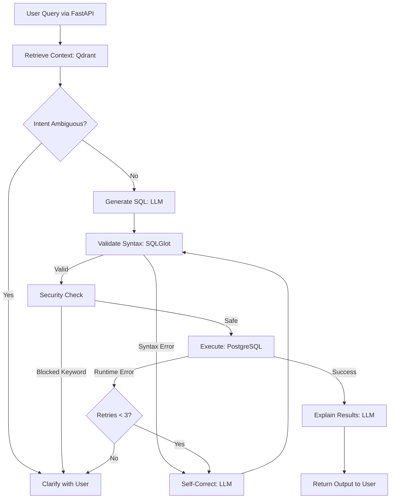

# Text-to-SQL Agent

A robust, self-correcting, and production-ready Text-to-SQL engine built with **LangGraph**, **RAG (Qdrant)**, **FastAPI**, and **Langfuse**. 

Unlike standard "prompt-in, query-out" scripts, this agent utilizes an explicit state machine to retrieve context, generate dialect-specific queries, validate syntax completely offline, securely execute in a sandboxed environment, and iteratively self-correct if database errors occur.

---

## ❓ Why This Exists (The Challenges Solved)

Building a Text-to-SQL engine that humans can actually trust in a production environment is incredibly difficult. Naive LLM approaches fail for several reasons. Here is how this architecture solves them:

### 1. The Hallucination Problem (Invented Columns)
* **Challenge:** LLMs naturally guess column names based on their training data (e.g., generating `first_name` and `last_name` when the database only has `full_name`).
* **Solution:** **Dual-Pipeline RAG.** Before generation, the agent searches a local Qdrant Vector DB to retrieve exact *Schema Chunks* and *Business Rules*. The LLM is strictly prompted to use *only* the retrieved context.

### 2. The Domain Knowledge Gap (Ambiguity)
* **Challenge:** "What is our MRR?" means nothing to an LLM without the business formula.
* **Solution:** **Knowledge Base Indexing.** We embed markdown documents containing specific KPI definitions and edge cases (e.g., "MRR = SUM(monthly_fee) WHERE status = 'active'"). The agent retrieves these rules alongside the schema.
* **Solution (Disambiguation):** If a query is too vague, the LangGraph state machine halts execution and routes to a `Clarification Node`, asking the user to specify their intent rather than guessing.

### 3. Syntax & Dialect Errors
* **Challenge:** Extracting a month in Postgres is different from BigQuery. LLMs frequently mix these up, leading to wasted database round-trips.
* **Solution:** **Offline AST Validation.** We use `SQLGlot` to parse the generated SQL into an Abstract Syntax Tree (AST). If the syntax is invalid, the error is caught instantly in Python and looped back to the LLM for correction *before* touching the database.

### 4. Database Security Risks
* **Challenge:** Prompt injection could lead to a `DROP TABLE` command.
* **Solution:** **Strict Execution Sandbox.** The AST is validated against a strict blocklist of DML/DDL keywords (e.g., `INSERT`, `DROP`, `ALTER`). Furthermore, queries are executed using a restricted read-only PostgreSQL role with a strict `statement_timeout`.

---

## 🏗️ High-Level Design & Architecture

The core of the system is a **LangGraph State Machine**. It passes a strictly typed `AgentState` object (containing the user query, retrieved context, SQL, errors, and retry counts) through a series of deterministic nodes.



### System Components:
1. **Client Gateway:** `FastAPI` + `Pydantic` for request validation.
2. **Orchestrator:** `LangGraph` state machine for deterministic routing.
3. **Context Engine:** `Qdrant` storing Schema + Knowledge Base vectors.
4. **Validation Layer:** `SQLGlot` for pure-Python parsing.
5. **Database Sandbox:** `PostgreSQL` (Read-only user + timeouts).
6. **Telemetry:** `Langfuse` for tracing LLM execution.

---

## 🛡️ Validation Pipeline (How it works)

Security and accuracy are enforced in three layers before a query is ever executed:

1. **LLM Constraint:** The system prompt forces the model to output a JSON object containing its assumptions alongside the SQL. This forces "chain of thought" alignment with the retrieved context.
2. **Abstract Syntax Tree (AST) Parsing:** 
   ```python
   # SQLGlot catches missing parentheses, invalid dialect syntax, etc.
   import sqlglot
   try:
       ast = sqlglot.parse(generated_sql, dialect="postgres")
   except sqlglot.errors.ParseError as e:
       # Error routed back to LangGraph Correct Node
   ```
3. **Keyword & AST Traversal:** We traverse the parsed AST to ensure no mutation commands exist. Even if an LLM tries to hide a `DROP TABLE` inside a complex subquery, the AST parser will flag the node type and block the execution.

---

## 👁️ Observability & Telemetry (Langfuse)

To move from a prototype to a production system, you must be able to see *how* the agent is making decisions. This project integrates **Langfuse** natively.

* **Trace Granularity:** Every single request generates a unique `Trace`.
* **Span Tracking:** Every LangGraph node (Retrieve, Generate, Validate, Execute, Correct) is wrapped as a `Span`. You can see exactly how many milliseconds the validation node took versus the generation node.
* **Cost & Token Tracking:** By passing the raw LLM responses back to Langfuse, we log exact token counts per graph run.
* **Correction Monitoring:** If the agent takes 3 loops to generate a correct query, Langfuse records the exact error messages the database threw and how the LLM responded to them.

---

## 🚀 Getting Started

### Prerequisites
* Docker & Docker Compose
* Python 3.11+
* Access to an LLM provider (e.g., Groq for free Llama 3, or Anthropic/OpenAI)

### 1. Spin up Infrastructure
```bash
# Starts PostgreSQL (App DB), Qdrant (Vector DB), and Langfuse (Observability)
docker-compose up -d
```

### 2. Index the Environment
```bash
python scripts/seed_database.py
python scripts/index_rag.py
```

### 3. Run the API Gateway
```bash
uvicorn app.main:app --reload --port 8000
```
